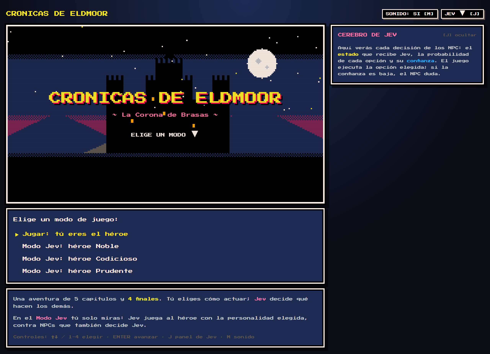
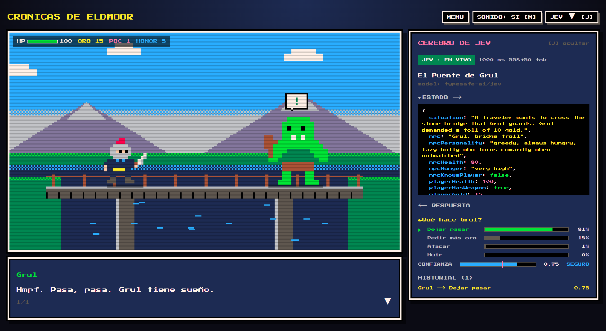
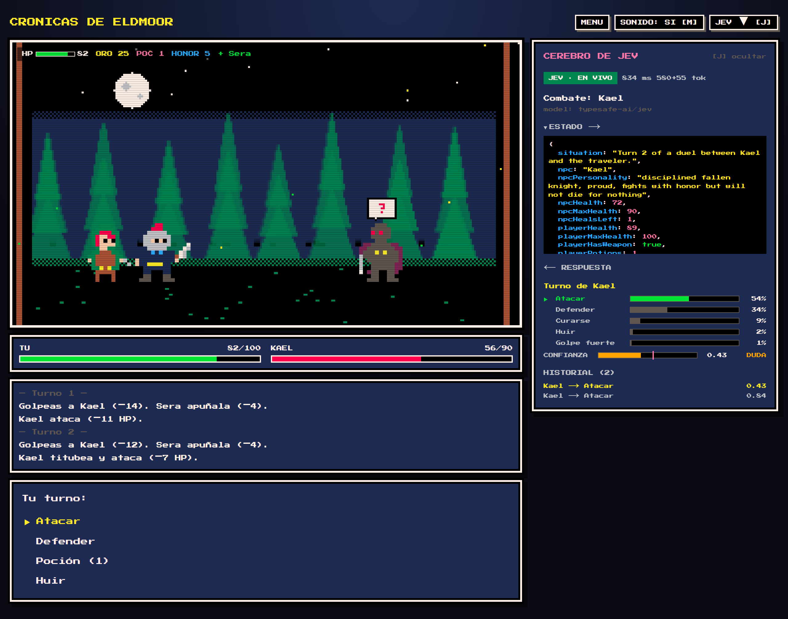
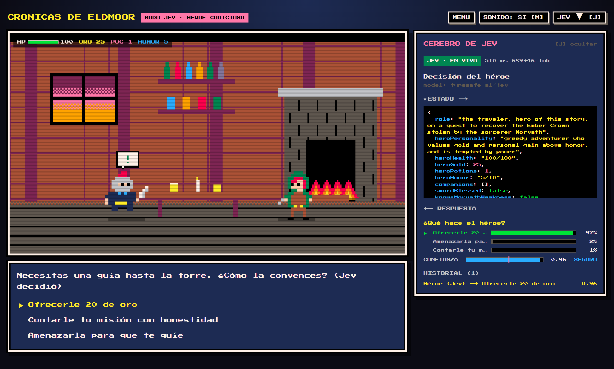
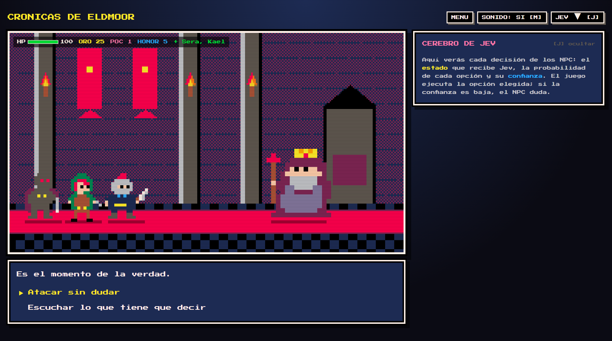
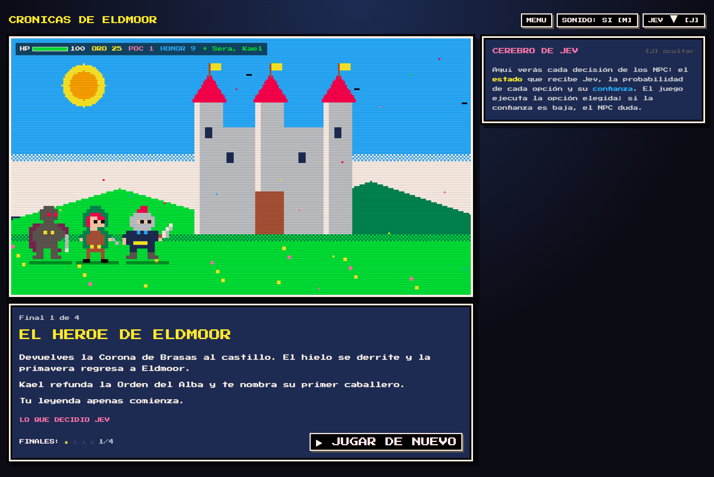

# Crónicas de Eldmoor

RPG pixel art 8-bit donde los NPC **toman decisiones con Jev** (TypeSafe) vía Vercel AI Gateway,
o con [**Laya**](https://github.com/NandhaKishorM/laya), su alternativa open source autoalojada.
Jev no genera diálogo: recibe un estado tipado y devuelve `choice` + `probabilities` + `confidence`,
y el juego ejecuta esa decisión. 5 capítulos, combates por turnos y 4 finales.



## Capturas

**Grul decide en vivo.** El panel *Cerebro de Jev* muestra el estado que recibe Jev, la probabilidad de cada opción y su confianza.



**Combate por turnos.** Cada turno del enemigo lo elige Jev; con confianza baja (DUDA) el NPC titubea y pega más flojo.



| Modo Jev: Jev juega al héroe | La Torre de Morvath | Final: El Héroe de Eldmoor |
| --- | --- | --- |
|  |  |  |

## Mapa de decisiones

[`docs/diagrams/decisiones.excalidraw`](docs/diagrams/decisiones.excalidraw) recoge cada elección del héroe,
cada decisión de los NPC, los combates y cómo se llega a cada uno de los 4 finales. Se abre en
[excalidraw.com](https://excalidraw.com) (menú → Abrir) y hay una vista previa en
[`docs/diagrams/decisiones.svg`](docs/diagrams/decisiones.svg).

## Arranque

```bash
pnpm install
```

Crea `.env.local` a partir de `.env.example` con tu key del AI Gateway (o usa
`pnpm dlx vercel ai-gateway setup` / `vercel env pull`):

```
AI_GATEWAY_API_KEY=vck_...
DECISION_PROVIDER=jev   # o laya
```

```bash
pnpm dev
```

Abre http://localhost:3000. Añade `?debug=1` para saltar a cualquier nodo y sobrescribir el estado.

## Cómo se usa Jev

- `lib/jev/encounters.ts` — todas las preguntas (choice / boolean / score) por encuentro.
- `app/api/decide/route.ts` — único punto que llama a Jev; el cliente solo envía `{ encounterId, state }`.
- `lib/jev/server.ts` — `experimental_evaluate({ model: "typesafe-ai/jev", state, questions })`.
  La confianza viene en `providerMetadata.typesafe.confidence`.
- `lib/story/story.ts` — la historia como datos; cada nodo `jev` construye el estado y resuelve la decisión.
- Confianza bajo el umbral del motor (Jev 0.55, Laya 0.05) → el NPC **duda**: te da un golpe inicial, pega más flojo y no llega a huir.
- Si el Gateway falla, un fallback local mantiene el juego en marcha (marcado "OFFLINE" en el panel).

## Usar Laya

[Laya](https://github.com/NandhaKishorM/laya) (Apache 2.0) es un motor de decisiones basado en encoders
que habla el mismo protocolo `POST /v1/systemone` que Jev. Corre en local (CPU o GPU), sin coste por token.

1. Levanta `laya-serve` con Docker desde un clon del repo de Laya:

   ```bash
   git clone https://github.com/NandhaKishorM/laya && cd laya
   LAYA_PRELOAD=1 LAYA_MODELS=english,multilingual docker compose -f compose.yaml -f compose.http.yaml up --build laya-serve
   ```

   Con GPU NVIDIA añade `-f compose.cuda.yaml`. Escucha en `http://localhost:8000`.

   Sin Docker (Python 3.10+):

   ```bash
   python -m venv .venv && .venv/bin/pip install "laya[serve]"
   LAYA_DEVICE=cpu LAYA_PRELOAD=1 LAYA_MODELS=english,multilingual .venv/bin/laya-serve
   ```

   El primer arranque descarga ~1.5 GB de pesos desde Hugging Face; espera a que `GET /health` responda 200.

   > **Precarga `multilingual`.** Las opciones del héroe y los textos de la historia están en español, y el
   > router de Laya los manda al checkpoint `multilingual`. Si no está precargado, la primera petición en
   > español lo descarga en caliente (~640 MB, varios minutos): el servidor deja de responder y el juego
   > queda en OFFLINE hasta que termina.

   > **Windows con Smart App Control activo:** bloquea las DLL de PyTorch
   > (`WinError 4551 ... Control de aplicaciones bloqueó este archivo`). Corre Laya dentro de WSL2
   > (o Docker Desktop, que usa WSL2): `localhost:8000` queda accesible desde Windows igual.
2. En `.env.local`: `LAYA_BASE_URL=http://localhost:8000` (y `LAYA_API_KEY` si el servidor la exige).
3. Elige **Laya** en el selector *Motor de decisiones* del título (tecla `E`), o pon `DECISION_PROVIDER=laya`
   para que sea el motor por defecto. La elección se recuerda en el navegador.

Detalles de la integración (`lib/jev/laya.ts`):

- Las preguntas `boolean` se envían como `noul` y su `noul` (P(sí)) vuelve como `probability`.
  `choice` y `score` se envían tal cual; las listas del estado se aplanan a texto.
- La llamada se hace desde el servidor (rutas `/api/decide` y `/api/hero`), así que no hace falta CORS.
- Si Laya no responde, se usa el mismo fallback local (panel: "OFFLINE · FALLBACK (LAYA)").
- Umbral de duda por motor (`HESITATION_THRESHOLDS` en `lib/jev/types.ts`): Jev 0.55, Laya 0.05. Laya devuelve
  distribuciones mucho más planas con los textos del juego (mediana de confianza ~0.17 en 162 decisiones
  reales), así que con 0.55 dudaba en casi todo; con 0.05 duda en ~1 de cada 4 decisiones de NPC. Para
  volver a medirlo con el servidor corriendo: `pnpm dlx tsx scripts/sample-confidence.ts laya`.

## Modo Jev

En el título puedes elegir **Modo Jev**: Jev juega al héroe (con personalidad Noble, Codicioso o Prudente)
contra NPCs que también decide Jev. Tú solo miras. Las opciones del héroe se construyen en el servidor a
partir del nodo de la historia (`lib/jev/hero.ts`, `app/api/hero/route.ts`), así que el cliente nunca
define las preguntas; en combate, Jev elige la acción del héroe con el encuentro `hero_combat`.

El Modo Jev también funciona con Laya como motor: entonces Laya juega al héroe contra NPCs decididos por Laya.

Controles: ↑↓ / 1-4 elegir · ENTER avanzar · E motor (en el título) · J panel de decisiones · M sonido.
